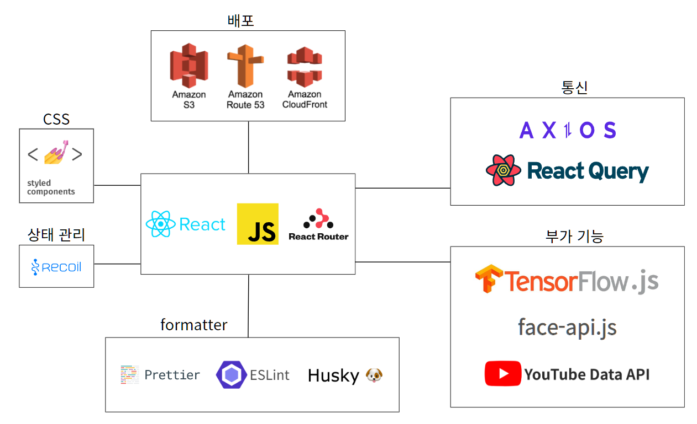
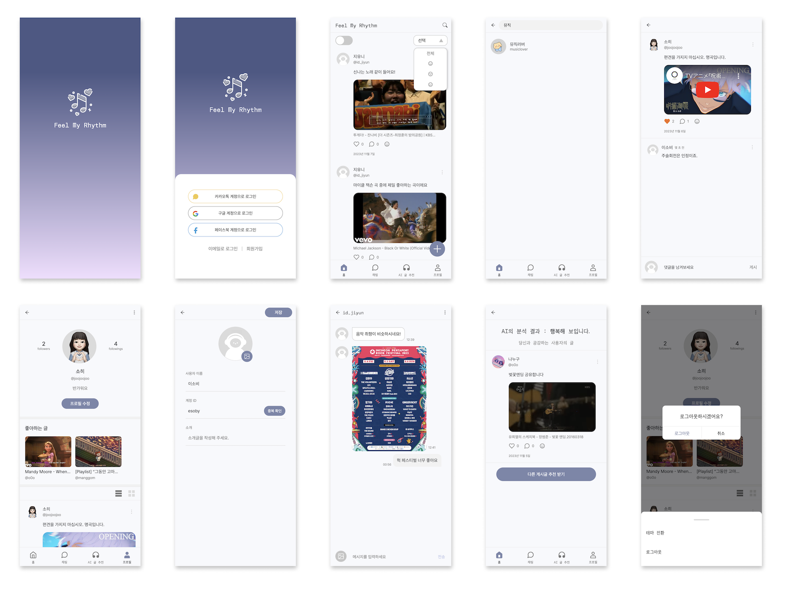
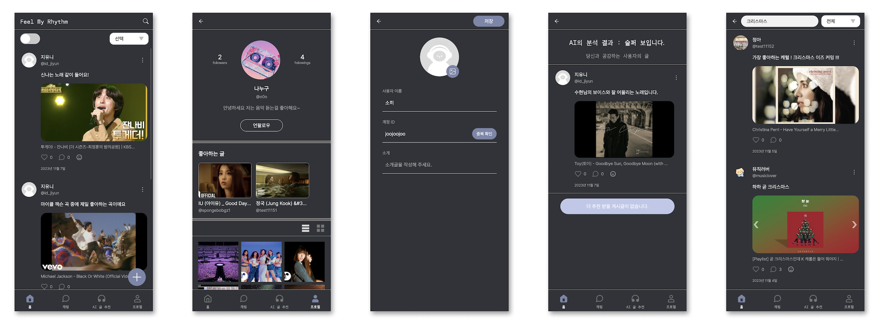

<h1 align="center">Feel My Rhythm 🎧</h1>
</br>

<p align="center">

</p>

</br>

### 💫 Feel My Rhythm 배포 링크 및 테스트 계정

👉🏻 [Feel My Rhythm](https://www.feelmyrhythm.com '바로가기')

```수정하기
ID: test12345@gmail.com
PW: test1234!
```

</br>

## 1. 서비스 소개

🎧 <em>감정과 음악, 그리고 사람을 연결하는 <strong>Feel My Rhythm</strong>입니다.</em>

- Youtube의 음악 영상을 업로드하고, 취향이 맞는 사람들과 소통해 보세요!

- AI 감정 분석 기능을 통해 나의 감정에 공감하는 사람들을 만나 보세요!

</br>

## 2. 팀 소개

안녕하세요, 저희는 멋쟁이사자처럼 프론트엔드스쿨 7기 🍙 삼김조 🍙입니다.

</br>

<table>
  <tbody>
    <tr>
      <td align="center"><a href="https://github.com/merrybmc"><br /><sub><b> FE 조병민(팀장)</b></sub></a><br /></td>
      <td align="center"><a href="https://github.com/esoby"><br /><sub><b>FE 김소희</b></sub></a><br /></td>
      <td align="center"><a href="https://github.com/kirnjiyun"><br /><sub><b>FE 김지윤</b></sub></a><br /></td>
      <td align="center"><a href="https://github.com/haileyja"><br /><sub><b>FE 김정아</b></sub></a><br /></td>
     <tr/>
  </tbody>
</table>

</br>

## 3. 역할 분담

🗂[ 요구사항 명세 / 간트 차트](https://docs.google.com/spreadsheets/d/1-1brcFSSZEuCGJYREySDQQqzf1r9IUlHcseddHbIGrU/edit?pli=1#gid=853750057)

</br>

## 4. 개발 기간 (23.10.16 ~ 23.11.07)

| 주차                      |                                                                                                     |
| ------------------------- | --------------------------------------------------------------------------------------------------- |
| 1주차 </br> 10.16 ~ 10.22 | - 주제 선정, 기술 스택 및 협업툴 선정, 컨벤션 정리 </br> - Figma UI 디자인 작업, 기능 요구사항 명세 |
| 2주차 </br> 10.23~ 10.29  | - 기획 구체화 </br> - 페이지별 UI 구현                                                              |
| 3주차 </br> 10.30~ 11.05  | - 분담한 페이지 내 API 기능 구현 </br> - 기능별 테스트 후 테스트 케이스 작성 및 보완                |
| 4주차 </br> 11.06~ 11.07  | - 배포 </br> - 실 유저 테스트 및 버그 수정                                                          |

</br>

## 5. 협업 방식

  <div>
    
    
    
    
  </div>

- Github를 통해 프로젝트 코드 공유 및 버전 관리
- Git Flow 전략으로 main, develop, feature 브랜치별 작업 / 관리
- 피그마의 공유 프로젝트로 기본적인 와이어 프레임, UI 작업 진행
- 디스코드를 이용하여 데일리 스크럼을 진행하며 각자의 진행 상황을 공유
- 디스코드의 보이스 채널에서 실시간 커뮤니케이션 및 페어 프로그래밍 진행
- 구글 스프레드시트를 이용해 프로젝트 진행 사항, 공유 사항 등을 기록
  </br>
  </br>
  </br>

## 6. 개발 환경

### 🛠 기술 스택

<div>
    
  
  
  
</br> 
    
  
  
  
  
</div>

### 🪜 아키텍처



### 📋 컨벤션

🗂[ 프로젝트 컨벤션](https://docs.google.com/spreadsheets/d/1-1brcFSSZEuCGJYREySDQQqzf1r9IUlHcseddHbIGrU/edit#gid=946491402)

</br>

## 7. 프로젝트 폴더 구조

```
📁 FeelMyRhythm
├──📁 public
├──📁 src
│   ├──📁 Apis
│   ├──📁 Assets
│   │   ├──📁 style
│   │   │  └──📄 GlobalStyle
│   │   └──📁 images
│   ├──📁 Components
│   │   ├──📁 404
│   │   ├──📁 Chat
│   │   ├──📁 Common
│   │   ├──📁 Emotion
│   │   ├──📁 Follow
│   │   ├──📁 Home
│   │   ├──📁 Post
│   │   ├──📁 Profile
│   │   ├──📁 Randing
│   │   ├──📁 Sign
│   │   └──📁 write
│   ├──📁 Hooks
│   ├──📁 Pages
│   │   ├──📁 Chat
│   │   ├──📁 Default
│   │   ├──📁 Emotion
│   │   ├──📁 Followers
│   │   ├──📁 Followings
│   │   ├──📁 Home
│   │   ├──📁 Post
│   │   ├──📁 Profile
│   │   ├──📁 Randing
│   │   ├──📁 Sign
│   │   └──📁 write
│   ├──📁 Router
│   ├──📁 Store
│   ├──📁 Util
│   ├──📄 App.js
│   └──📄 index.js
├──📄 .env
└──📄 README.md
```

<br />

## 8. UI

<p align="center">

</p>

#### - 다크모드

<p align="center">

</p>
<br />

## 9. 기능 소개

### 1) 시작 화면

| 스플래시                                                                                                                                                                                                         | 로그인                                                                                                                                                                                                  | 회원가입                                                                                                                                                                                                                                                             |
| ---------------------------------------------------------------------------------------------------------------------------------------------------------------------------------------------------------------- | ------------------------------------------------------------------------------------------------------------------------------------------------------------------------------------------------------- | -------------------------------------------------------------------------------------------------------------------------------------------------------------------------------------------------------------------------------------------------------------------- |
|  |  |  |

### 2) 홈

| 전체 게시글 보기                                                                                                            | 썸네일 호버 시 동영상 재생                                                                                                                                                                  | 무한스크롤                                                                                                                            |
| --------------------------------------------------------------------------------------------------------------------------- | ------------------------------------------------------------------------------------------------------------------------------------------------------------------------------------------- | ------------------------------------------------------------------------------------------------------------------------------------- |
|  |  |  |

| 팔로잉 유저 글만 보기                                                                                                  | 팔로잉 없을 경우 계정 검색                                                                                                                                 | 팔로잉 유저의 글이 없는 경우                                                                         |
| ---------------------------------------------------------------------------------------------------------------------- | ---------------------------------------------------------------------------------------------------------------------------------------------------------- | ---------------------------------------------------------------------------------------------------- |
|  |  |  |

### 3) 채팅

| 채팅 입력하기                                                              |
| -------------------------------------------------------------------------- |
|  |

### 4) 감정 AI 검색

| 웃는 표정                                                                                            | 슬픈 표정                                                                                            | 화난 표정                                                                                            |
| ---------------------------------------------------------------------------------------------------- | ---------------------------------------------------------------------------------------------------- | ---------------------------------------------------------------------------------------------------- |
|  |  |  |

### 5) 게시글

| 게시글 작성                                                                                                                             | 게시글 검색 및 감정 필터링                                                                                                                                                 | 감정 선택 후 게시글 보기                                                                                                                                                                |
| --------------------------------------------------------------------------------------------------------------------------------------- | -------------------------------------------------------------------------------------------------------------------------------------------------------------------------- | --------------------------------------------------------------------------------------------------------------------------------------------------------------------------------------- |
|  |  |  |

| 게시글 좋아요                                                                                | 게시글 수정                                                                                  | 공유할 영상 선택하기                                                                     |
| -------------------------------------------------------------------------------------------- | -------------------------------------------------------------------------------------------- | ---------------------------------------------------------------------------------------- |
|  |  |  |

### 6) 댓글

| 댓글 작성                                                                                                      | 댓글 삭제                                                                                                               |
| -------------------------------------------------------------------------------------------------------------- | ----------------------------------------------------------------------------------------------------------------------- |
|  |  |

### 7) 프로필

| 프로필 페이지                                                                  | 프로필 수정                                                                 | 팔로우/팔로잉 목록                                                            |
| ------------------------------------------------------------------------------ | --------------------------------------------------------------------------- | ----------------------------------------------------------------------------- |
|  |  |  |

| 좋아하는 글이 삭제된 경우                                                                                                                                                                                                                                                                    | 다크모드 전환                                                                                                              |
| -------------------------------------------------------------------------------------------------------------------------------------------------------------------------------------------------------------------------------------------------------------------------------------------- | -------------------------------------------------------------------------------------------------------------------------- |
|  |  |

### 8) 태블릿 화면 구현

| 홈화면                                                                                                                                            |
| ------------------------------------------------------------------------------------------------------------------------------------------------- |
|  |

| 게시글 작성                                                                                                                                                     |
| --------------------------------------------------------------------------------------------------------------------------------------------------------------- |
|  |

| 다른 유저의 프로필 보기 (좋아하는 글)                                                                                                                                                               |
| --------------------------------------------------------------------------------------------------------------------------------------------------------------------------------------------------- |
|  |

| 다크모드                                                                                                                                                   |
| ---------------------------------------------------------------------------------------------------------------------------------------------------------- |
|  |
