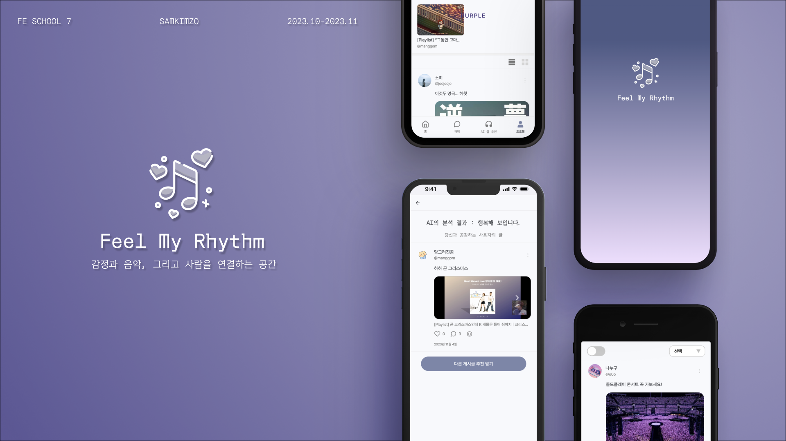
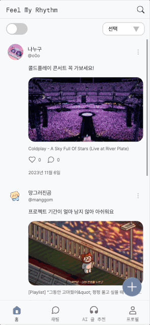

<h1 align="center">Feel My Rhythm 🎧</h1>
</br>

<p align="center">

</p>

</br>

#### 💫 Feel My Rhythm 배포 링크 및 테스트 계정

💡 [Feel My Rhythm](https://www.feelmyrhythm.com '바로가기')

```수정하기
ID: test1115@test.com
PW: test1115*
```

</br>

#### 💻 프로젝트 상세 진행 과정 엿보기

💡[프로젝트 구글 시트](https://docs.google.com/spreadsheets/d/1-1brcFSSZEuCGJYREySDQQqzf1r9IUlHcseddHbIGrU/edit?pli=1#gid=0)

</br>

#### 📚 프로젝트 발표 자료

💡[내용](주소)

</br>

## 1.서비스 소개

🎧 <em>감정과 음악, 그리고 사람을 연결하는 <strong>Feel My Rhythm</strong>입니다.</em>

- Youtube의 음악 영상을 업로드하고, 취향이 맞는 사람들과 소통해 보세요!

- AI 감정 분석 기능을 통해 나의 감정에 공감하는 사람들을 만나 보세요!

</br>

## 2. 팀 소개

안녕하세요, 저희는 멋쟁이사자처럼 프론트엔드스쿨 7기 🍙 삼김조 🍙입니다.

</br>

| 조병민           | 김소희 | 김정아 | 김지윤 |
| ---------------- | ------ | ------ | ------ |
| photo            | photo  | photo  | photo  |
| FE / Team Leader | FE     | FE     | FE     |

</br>

## 3. 역할 분담

🗂[GoogleDocs 요구사항 명세](https://docs.google.com/spreadsheets/d/1-1brcFSSZEuCGJYREySDQQqzf1r9IUlHcseddHbIGrU/edit?pli=1#gid=2124562970)

</br>

## 4. 개발 기간 (23.10.16 ~ 23.11.07)

| 주차                      |                                                                                                     |
| ------------------------- | --------------------------------------------------------------------------------------------------- |
| 1주차 </br> 10.16 ~ 10.22 | - 주제 선정, 기술 스택 및 협업툴 선정, 컨벤션 정리 </br> - Figma UI 디자인 작업, 기능 요구사항 명세 |
| 2주차 </br> 10.23~ 10.29  | - 기획 구체화 </br> - 페이지별 UI 구현                                                              |
| 3주차 </br> 10.30~ 11.05  | - 분담한 페이지 별 API 기능 구현 </br> - 테스트 후 테스트 케이스 작성 및 수정                       |
| 4주차 </br> 11.06~ 11.07  | - 최종 테스트 및 버그 수정 </br> - 배포                                                             |

## 5. 개발 환경

### 💛 기술 스택

<div>
    
  
  
  
</br> 
    
  
  
  
  
   
</div>

- 리액트 상태관리 라이브러리로, 전역 상태 관리를 용이하게 그리고 리액트의 컴포넌트 기반 아키텍처와 잘 어우러 질수 있게 리코일을 사용했습니다.
- 데이터를 가져오고 캐시하고, 동기화 하는 복잡한 로직을 추상화하여 쉽게 데이터를 관리할수 있게 리액트 쿼리를 사용했습니다.

## 프로젝트 관리

Github Issues / Github Pull Requests

## 배포

 </br>

### 컨벤션

#### commit 컨벤션

| 분류          | 컨벤션                                  |
| ------------- | --------------------------------------- |
| 기능 구현     | "feat(기능분류) : 설명 (#이슈번호)"     |
| 버그 수정     | "fix(기능분류) : 내용 (#이슈번호)"      |
| 설정 변경     | "chore : 내용 (#이슈번호)"              |
| 코드 리팩토링 | "refactor(기능분류) : 내용 (#이슈번호)" |

</br>

#### eslint

```js
module.exports = {
  root: true,
  env: {
    es6: true
  },
  extends: ['react-app', 'eslint:recommended', 'plugin:prettier/recommended', 'prettier'],
  rules: {
    'no-var': 'error',
    'no-multiple-empty-lines': 'error',
    // 'no-console': ['error', {allow: ['warn', 'error', 'info']}],
    eqeqeq: 'error',
    'react/jsx-pascal-case': 'error',
    'react/jsx-key': 'error',
    'dot-notation': 'error',
    'linebreak-style': 0,
    'no-unused-vars': 'off',
    'prettier/prettier': [
      'error',
      {
        endOfLine: 'auto'
      }
    ]
  }
};
```

</br>

#### prettier

```js
module.exports = {
  printWidth: 120,
  tabWidth: 2,
  semi: true,
  singleQuote: true,
  jsxSingleQuote: true,
  trailingComma: 'none',
  bracketSpacing: true,
  bracketSameLine: true,
  jsxBracketSameLine: true,
  arrowParens: 'always',
  quoteProps: 'as-needed'
};
```

</br>

## 6.협업 과정

## 7. 프로젝트 폴더 구조

```

📁 FeelMyRhythm
├──📁 .github
├──📁 .husky
├──📁 node_modules
├──📁 public
├──📁 src
│   ├──📁 Apis
│   ├──📁 Assets
│   │   ├──📁 style
│   │   │   ├──📄 GlobalStyle
│   │   ├──📁 images
│   ├──📁 Components
│   │   ├──📁 Chat
│   │   ├──📁 Default
│   │   ├──📁 Emotion
│   │   ├──📁 Floolwers
│   │   ├──📁 Followings
│   │   ├──📁 Home
│   │   ├──📁 Post
│   │   ├──📁 Randing
│   │   ├──📁 Sign
│   │   ├──📁 wite
│   │   └──📁 Profile
│   ├──📁 Hooks
│   ├──📁 Pages
│   │   ├──📁 Chat
│   │   ├──📁 Default
│   │   ├──📁 Emotion
│   │   ├──📁 Followers
│   │   ├──📁 Followings
│   │   ├──📁 Home
│   │   ├──📁 Post
│   │   ├──📁 Randing
│   │   ├──📁 Sign
│   │   ├──📁 write
│   │   └──📁 Profile
│   ├──📁 Router
│   ├──📁 Store
│   └──📁 Util
├──📄 .env
├──📄 .eslintrc.js
├──📄 .gitignore
├──📄 .prettierrc.js
├──📄 package-lock.json
├──📄 package.json
└──📄 README.md

```

<br />

## 8. 기능 소개

### 1) 시작 화면

| 스플래시                                                                                                                                                                                                         | 로그인                                                                                                                                                                                                  | 회원가입과 프로필 설정                                                                                                                                                                                                                                               |
| ---------------------------------------------------------------------------------------------------------------------------------------------------------------------------------------------------------------- | ------------------------------------------------------------------------------------------------------------------------------------------------------------------------------------------------------- | -------------------------------------------------------------------------------------------------------------------------------------------------------------------------------------------------------------------------------------------------------------------- |
|  |  |  |

### 2) 홈

| 전체 게시글 보기                                                                                                            | 이미지에 마우스 올리면 동영상 재생                                                                                                                                                          | 무한스크롤                                                                                                          |
| --------------------------------------------------------------------------------------------------------------------------- | ------------------------------------------------------------------------------------------------------------------------------------------------------------------------------------------- | ------------------------------------------------------------------------------------------------------------------- |
|  |  |  |

| 팔로우를 하지 않을때와 계정검색                                                                                                 | 팔로우 글만 보기                                                                                  | 내가 팔로우 하는 계정이 글을 안 올렸을때                                                             |
| ------------------------------------------------------------------------------------------------------------------------------- | ------------------------------------------------------------------------------------------------- | ---------------------------------------------------------------------------------------------------- |
|  |  |  |

### 3) 채팅

| 채팅 입력하기 (실제 작동 x)                                                |
| -------------------------------------------------------------------------- |
|  |

### 4) 감정 AI 검색

| 웃는 표정                                                                                            | 슬픈표정                                                                                             | 화난표정                                                                                             |
| ---------------------------------------------------------------------------------------------------- | ---------------------------------------------------------------------------------------------------- | ---------------------------------------------------------------------------------------------------- |
|  |  |  |

### 5) 게시글

| 게시글 작성                                                                                                                             | 게시글 검색 및 감정 필터링                                                                                                                                                 | 감정 선택 후 게시글 보기                                                                                                                                                                |
| --------------------------------------------------------------------------------------------------------------------------------------- | -------------------------------------------------------------------------------------------------------------------------------------------------------------------------- | --------------------------------------------------------------------------------------------------------------------------------------------------------------------------------------- |
|  |  |  |

| 게시글 좋아요                                                                                | 게시글 수정                                                                                  | 게시글 작성시 유튜브 영상 상세보기                                                       |
| -------------------------------------------------------------------------------------------- | -------------------------------------------------------------------------------------------- | ---------------------------------------------------------------------------------------- |
|  |  |  |

### 6) 댓글

| 댓글 작성                                                                                                      | 댓글 삭제                                                                                                               |
| -------------------------------------------------------------------------------------------------------------- | ----------------------------------------------------------------------------------------------------------------------- |
|  |  |

### 7) 프로필

| 내 프로필 페이지                                                                                                                                                    | 좋아요한 글을 작성자가 삭제한 경우                                                                                                                                                                                                                                                           |
| ------------------------------------------------------------------------------------------------------------------------------------------------------------------- | -------------------------------------------------------------------------------------------------------------------------------------------------------------------------------------------------------------------------------------------------------------------------------------------- |
|  |  |

| 프로필 수정                                                                                                       | 다크모드                                                                                                                   |
| ----------------------------------------------------------------------------------------------------------------- | -------------------------------------------------------------------------------------------------------------------------- |
|  |  |

### 8) 태블릿 화면 구현

| 홈화면                                                                                                                                            |
| ------------------------------------------------------------------------------------------------------------------------------------------------- |
|  |

| 게시글 작성                                                                                                                                                     |
| --------------------------------------------------------------------------------------------------------------------------------------------------------------- |
|  |

| 다른 유저의 프로필 보기 (좋아하는 글)                                                                                                                                                               |
| --------------------------------------------------------------------------------------------------------------------------------------------------------------------------------------------------- |
|  |

| 다크모드                                                                                                                                                   |
| ---------------------------------------------------------------------------------------------------------------------------------------------------------- |
|  |
